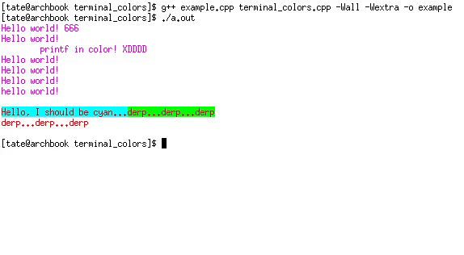

# terminal-colors 
A colorful terminal text effects library. It makes using terminal effects ie- color changes, blinking text, rich text, etc. easy by using tools the programmer is familiar with like **HTML colors** and stdio function wrappers instead of making you memorize escape sequences and manually convert colors.

## example.cpp running in xterm <!-- update this plz-->
 

# What's included?
## Intuitive Color Names
  - valid html colors can be used to specify colors instead of individual rgb components
  - examples: `rgb(120, 0, 255)`, `goldenrod`, `#3fe2a9`, `#333`
  - the parser is actually even less strict than html
  - examples: `333`, `120,0,255`

## color_printf()
  - `void color_printf(uint8_t r, uint8_t g, uint8_t b, const char* format, ...)`: use the r, g, and b values to give a 24bit color. 
  - `void color_printf(const char* color, const char* format, ...)`: enter a valid html `color` (see this if you are confused http://www.w3schools.com/html/html_colors.asp ).
    + note that standard color names are generally slower than hex or rgb values

## setFgColor() / setBgColor() 
  - the functions are the same for setBgColor, however it acts on the background instead of the foreground
  - `void setFgColor(uint8_t r, uint8_t g, uint8_t b)`: sets the foreground color to an rgb value
  - `void setFgColor(const char* color)`: sets the foreground color to a valid HTML color
  - `void setFgColor(void)`: sets the foreground color back to its original state

## setTermEffect()
  - `setTermEffect(uint8_t effect)`: sets the text effect to whichever text effect you would prefer, there are macros defined for eache effect, but I reccomend reading this ( https://en.wikipedia.org/wiki/ANSI_escape_code#CSI_codes ) wiki article. 
  
## resetANSI()
  - `resetANSI(void)`: resets the terminal back to its original/default state

## fsetFgColor(), fsetBgColor(), fsetTextEffect(), fresetANSI(), color_fprintf(), etc.
  - these serve the same function as the regular functions, but allow the output to be piped to a file other than stdout.
  - the first argument is the file to replace stdout

# Potential Issues:
  - **Endianess:** The `struct RGB_t` involves a specific byte ordering, it has only been tested on little-endian machines, but big-endian should work. If you have a big-endian machine please share your results. This library should produce undefined output on a middle-endian machine.
  - **OS/Terminal Compatibility:** this library was built for xterm in Arch Linux (2016). The colors should work in any terminal emulator which supports 24-bit colors. The effects are not uniform and you may want to refer to this article: https://en.wikipedia.org/wiki/ANSI_escape_code
  
